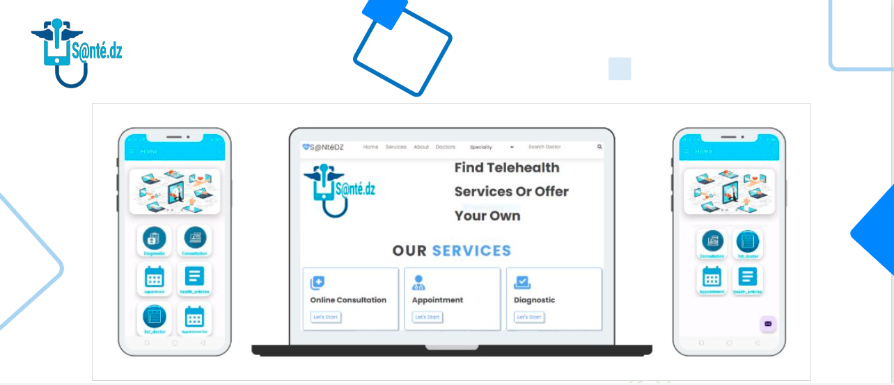

# 🏥 S@nté.Dz - Plateforme Intelligente de Télémédecine  

## 📌 Contexte du Projet  

**S@nté.Dz** est une plateforme intelligente de **diagnostic et suivi à distance des anomalies radiologiques**, développée dans le cadre d'un **projet de fin de cycle Master 2 (Juin 2023)**.  
Elle se compose d'une **application mobile** et d'un **site web dynamique**, permettant aux patients et médecins d'accéder à des services médicaux à distance. 

🖼️ **Aperçu du projet**  

---

## ⚠️ Problème  

L'Algérie rencontre plusieurs défis dans le domaine de la santé, notamment :  
- **📉 Manque de médecins spécialisés**, en particulier des radiologues.  
- **📈 Augmentation des cas de cancer**, mettant une pression énorme sur les professionnels de santé.  
- **🌍 Accès limité aux soins** dans les zones reculées, dû à la concentration des infrastructures médicales dans les grandes villes.  
- **🚨 Problèmes accrus en cas d'épidémies et de catastrophes naturelles**, compliquant encore plus l'accès aux soins.  

---

## ✅ Solution : S@nté.Dz  

🎯 **Une plateforme numérique intelligente pour améliorer l'accès aux soins médicaux à distance.**  

🔹 **Services pour les patients**  
- 📅 Prise de rendez-vous en ligne avec des médecins.  
- 🏥 Consultation et suivi médical à distance.  
- 📄 Accès aux **rapports médicaux et diagnostics**.  

🔹 **Services pour les médecins**  
- 📤 Téléchargement et analyse d'images médicales via des **modèles d'IA** pour un **diagnostic instantané**.  
- 🤝 Collaboration et échanges entre professionnels de santé.  

🧠 **Technologie IA**  
- 📊 **Détection et classification des anomalies radiologiques** grâce à des **modèles de Deep Learning** (segmentation & classification).

  🖼️ **Aperçu du projet**  

---

## 🛠 Technologies Utilisées  

### 📱 **Application Mobile**  
🔹 **Développement :** Android Studio, Java, XML  
🔹 **Base de Données :** Firebase  
🔹 **IA & Deep Learning :** Deux modèles pour **segmentation et classification**  

### 💻 **Site Web**  
🔹 **Frontend :** HTML, CSS, JavaScript, Bootstrap  
🔹 **Backend :** PHP, SQL  
🔹 **Base de Données :** MySQL via PhpMyAdmin  
🔹 **Serveur Local :** XAMPP  

---
## 🎥 Vidéos de Présentation  

📱 **Application Mobile**  
➡️ [Voir la vidéo](https://drive.google.com/file/d/1ioBSldJvUb0MbX6QoL0kRwB_RTyhD8Uk/view?usp=sharing)  

💻 **Site Web**  
➡️ [Voir la vidéo](https://drive.google.com/file/d/1L54sSAQckl59r5cUs3gQcReCUHTqb56Y/view?usp=sharing)  

---

## 📄 Rapport de Projet  

📥 **Télécharger le Rapport de Projet (PowerPoint)**  
➡️ [Rapport de Projet (PPT)](docs/rapport_sante_dz.pptx) 
